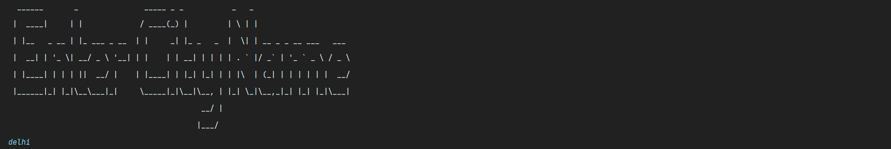
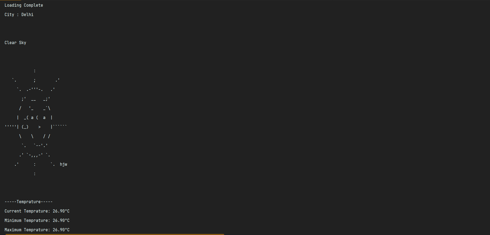
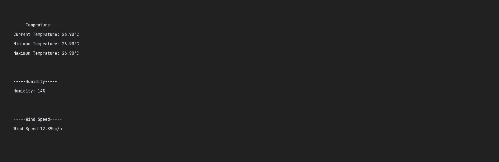

# temprature_cli_java
This is a temprature cli app in JAVA using API.

To use this project first of all you have to import a json.jar to parse json in java.

==========IMPORTANT==========

To use this project first of all you have to import a json library as a dependency in your IDE(like VS code, IntelljIDE).
Run this project in intelliJ IDEA for smooth experience.

step 1:

Enter a city name

Step 2: 
Hit Enter

